<div align="center">

# 🚗 ft_linear_regression


**A complete, step-by-step guide to the mandatory part — with math, diagrams, and every confusion answered inline.**

<br/>

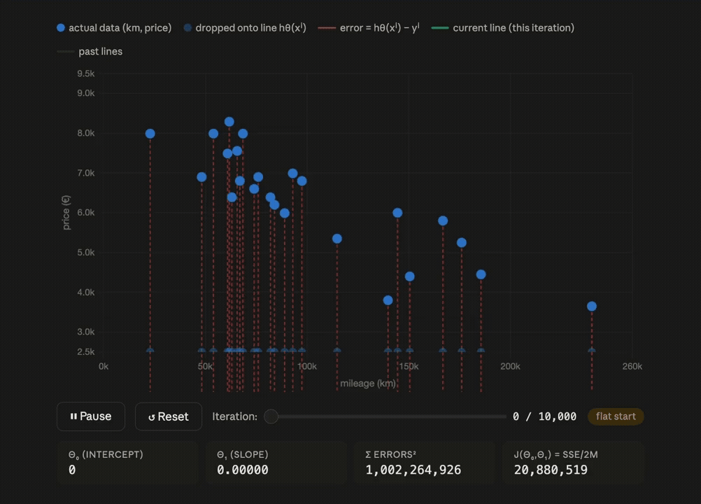

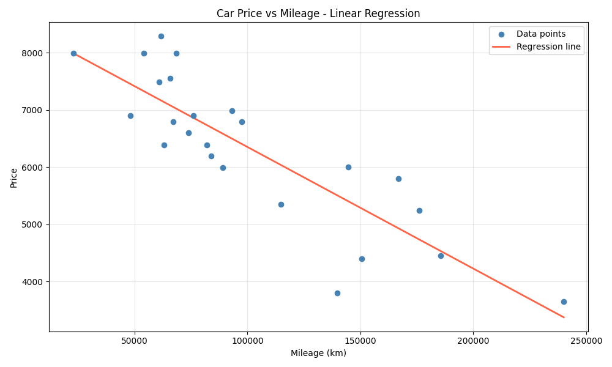

</div>

---

## 📑 Table of Contents

- 0. [🚗 Global Overview](#0-global-overview)
- 1. [📐 The Hypothesis — Our Prediction Line](#1-the-hypothesis--our-prediction-line)
- 2. [📊 The Cost Function J(θ₀, θ₁)](#2-the-cost-function-jθ₀-θ₁)
- 3. [🛷 How to Slope `θ₀,θ₁` to The Minimum (Using Derivatives)](#3-how-to-slope-θ₀θ₁-to-the-minimum-using-derivatives)
- 4. [🧮 Computing the Partial Derivatives](#4-computing-the-partial-derivatives)
- 5. [⚡ The Update Rule — Why the Minus Sign](#5-the-update-rule--why-the-minus-sign)
- 6. [🔄 Gradient Descent — The Full Algorithm](#6-gradient-descent--the-full-algorithm)
- 7. [⏹️ Stopping Condition](#7-stopping-condition)
- 8. [🔮 After Training — Making Predictions](#8-after-training--making-predictions)
- 9. [📝 Quick-Reference Summary](#9-quick-reference-summary)

---

## 0. Global Overview

### 🚗 ft_linear_regression – Global Overview

#### What’s the purpose of this project?
We have a dataset with car mileage (input) and car price (output).  
We want to train a model so that later, when you give it a new mileage, it can predict the price automatically.

Think of it as:
> 👉 **You enter mileage $\rightarrow$ the model replies with estimated price.**

#### How do we achieve that? (Step by step, simply)

1. **Visualise the data**  
   We plot all the data points on a graph (mileage on the horizontal axis, price on the vertical axis).  
   Our goal is to draw a straight line that goes through the “middle” of all those points – the line that best represents the trend.

2. **Why do we need that line?**  
   Because with that line, we can predict the price for any mileage (even ones not in the dataset).  
   The line is our model – it tells us the relationship between mileage and price.

3. **How do we draw a line?**  
   A straight line needs two variables to be defined.  
   In our case, those variables are called $\theta_0$ (intercept) and $\theta_1$ (slope).  
   The line is: $\text{price} = \theta_0 + \theta_1 \times \text{mileage}$

4. **Start with a flat line (zero knowledge)**  
   We begin with $\theta_0 = 0$ and $\theta_1 = 0$ – that’s a flat line at price 0 (very wrong, but it’s a starting point).

5. **Measure the error (how wrong is our line?)**  
   For every data point, we calculate the distance between the point and our current line.  
   The total error tells us how “bad” the line is. If the points lie exactly on a straight line, we can reach $\text{error} = 0$ (perfect). In real data, points rarely line up perfectly, but we can get the error very small – that means our line fits the data as well as possible. So we measure how wrong it is (the error/the line), then we change $\theta_0$ and $\theta_1$ a little bit and draw a new line. We measure the error again. We repeat this over and over – each time we try to draw a better line – until the error becomes very small.  
   
   *But how do we know how to change $\theta_0$ and $\theta_1$?* We don’t change them randomly. We need a smart way to know: Should we increase $\theta_0$ or decrease it? Should we increase $\theta_1$ or decrease it? By how much? That’s where the derivative comes in.

6. **The error function is a bowl – we want the bottom**  
   Remember that the error function, $J(\theta_0, \theta_1)$, has a parabolic bowl shape.  
   The bottom of the bowl is where the error is smallest – that’s our goal. To reach the bottom, we need to move $\theta_0$ and $\theta_1$ downhill on that bowl surface. “Downhill” means: if we are on the left side of the bowl, we move right (increase $\theta$); if on the right side, we move left (decrease $\theta$). Mathematically, we calculate the partial derivative of $J$ with respect to $\theta_0$ and $\theta_1$. The derivative tells us the slope of the bowl at our current position:
   - If the slope is positive $\rightarrow$ moving right increases the error $\rightarrow$ we should decrease $\theta$.
   - If the slope is negative $\rightarrow$ moving right decreases the error $\rightarrow$ we should increase $\theta$.
   
   Then we update $\theta_0$ and $\theta_1$ by a small step opposite to the slope. This is called **gradient descent**.

7. **Keep stepping downhill until we reach the bottom**  
   We repeat this process: Compute the derivatives (slopes) $\rightarrow$ Adjust $\theta_0$ and $\theta_1$ a little $\rightarrow$ Redraw the line $\rightarrow$ Measure the error again. After many steps, the error stops decreasing.  
   We have reached the bottom of the bowl – the best possible line that fits our data.  
   Then we save $\theta_0$ and $\theta_1$, and our model is trained!

8. **Save the trained model 💪**  
   Once we have those optimal $\theta_0$ and $\theta_1$, we save them.  
   Now our model is trained!  
   We can use it to predict any car’s price from its mileage.

---

## 1. The Hypothesis — Our Prediction Line

We assume that the price of a car depends **linearly** on its mileage. That means our model is a **straight line**:

$$ \Huge{\color{cyan}{h_\theta(x) = \theta_0 + \theta_1 \cdot x}} $$

| Symbol | Meaning |
|:---|:---|
| $x$ | mileage (input feature) |
| $h_\theta(x)$ | predicted price (output) |
| $\theta_0$ | intercept — predicted price when mileage = 0 |
| $\theta_1$ | slope — how much price changes per km |

In this tutorial we will start with **$\theta_0 = 0$** and **$\theta_1 = 0$**. That means your first prediction for every car is $\text{price} = 0$. I know that's completely wrong 😅 — but it doesn't matter. The algorithm will fix it later (trust the process).

<div align="center">


</div>

> 💡 **Flat line** = starting guess ($\theta_0=0, \theta_1=0$). **Sloped line** = after training. Gradient descent moves us from one to the other.

---

## 2. The Cost Function J(θ₀, θ₁)

We need a single number that measures **how wrong our current line is**. We use the Mean Squared Error, divided by 2 for convenience (it will be canceled later at the derivative):

$$
\huge \color{cyan}{
J(\theta_0, \theta_1) = \frac{1}{2m} \sum_{i=1}^{m} \left( h_\theta(x^{(i)}) - y^{(i)} \right)^2
}
$$ 

| Symbol | Meaning |
|:---|:---|
| $m$ | number of cars in the dataset (the average) |
| $x^{(i)}$, $y^{(i)}$ | mileage and actual price of car $i$ |
| $h_\theta(x^{(i)}) - y^{(i)}$ | error: predicted minus actual price |

### Why each design choice?

| Choice | Why |
|:---|:---|
| **Square** the error | Prevents positive and negative errors from cancelling. Punishes large errors more than small ones. |
| **Divide by m** | Gets the average — so $J$ doesn't grow just because the dataset is larger. |
| **Divide by 2** | Pure convenience: the 2 cancels when we take the derivative, making the formula cleaner. It doesn't change *where* the minimum is. |

### Error Computing
At each iteration, the model predicts the price of every car and computes the error between the predicted and actual values. These errors are used to calculate the cost function $J$, which measures how well the current regression line fits the data. Gradient descent then updates the parameters $\theta_0$ and $\theta_1$ to reduce this error. This process is repeated until the cost stops decreasing, resulting in the best-fitting regression line.

<div align="center">

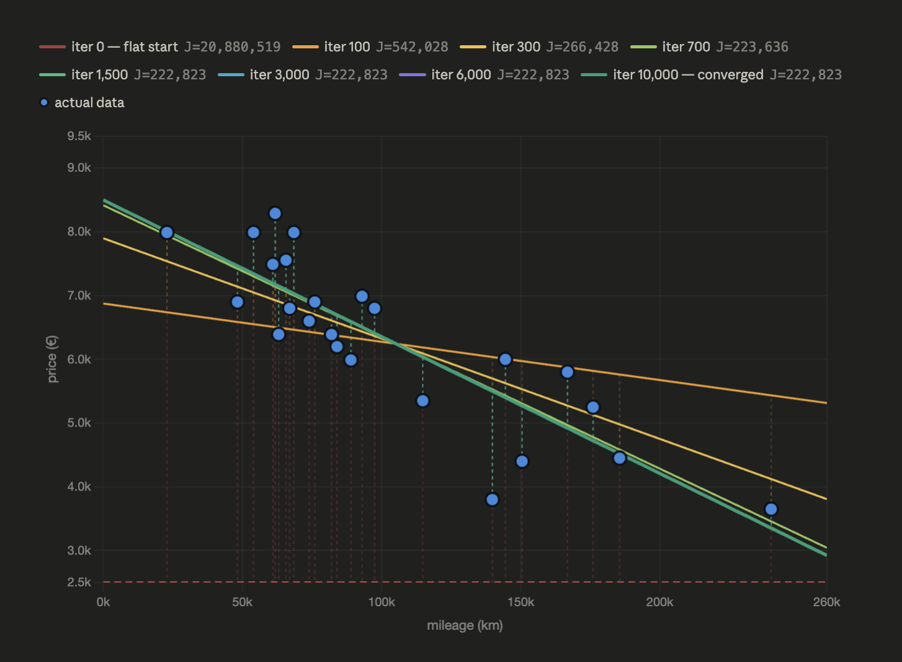

</div>

### How J looks as a surface
This graph is a representation of how the $J$ function looks like. As you can see, it is a parabolic‑shaped surface (because of squaring the error). So our objective is reaching the minimum (the bottom) of the function; the point where the cost is lowest, because the value of $J$ represents the total error of our model. The lower $J$ is, the closer our predictions are to the actual prices. Therefore, by finding the parameters $\theta_0, \theta_1$ that minimise $J$, we obtain the most accurate linear regression line for our dataset.

<div align="center">


</div>

### Gradient descent is a ball rolling down the bowl; each step improves the line
Left and right panels are two views of the same process. Each step down the bowl (left) corresponds to a rotation of the regression line toward the data (right). When the ball stops at the bottom, the gradient is zero, the line no longer moves, and you have found the unique $\theta_1$ that minimises total squared error across all data points.  
The bottom of the bowl **IS** the trained model. Not a step toward it — it **IS** it.

<div align="center">


</div>

---

> [!IMPORTANT]
> ### ❓ Confusion: "How can we compute J if we don't have the real hθ?"
>
> **$h_\theta(x)$ is always computable.** It's not the "true" model — it's just our current guess: $\theta_0 + \theta_1 \cdot x$. At any point in training, we know $\theta_0$ and $\theta_1$ (we initialized them to 0), and we know every $x^{(i)}$ from the dataset. So we can always compute $h_\theta(x^{(i)})$ and therefore $J$.
>
> The dataset (all $x^{(i)}$ and $y^{(i)}$) is **fixed**. The only things that change are $\theta_0$ and $\theta_1$.

> [!IMPORTANT]
> ### ❓ Confusion: "Why write J(θ₀, θ₁) instead of just J?"
>
> Because $J$ depends **only** on $\theta_0$ and $\theta_1$. The data never changes. Writing $J(\theta_0, \theta_1)$ makes it explicit: the only knobs we control are the two parameters. Our goal is to find the $(\theta_0, \theta_1)$ pair that makes $J$ as small as possible.

> [!IMPORTANT]
> ### ❓ Confusion: "How do we know J(θ₀, θ₁) is bowl‑shaped?"
>
> Because the formula of $J$ is:
>
> $$J(\theta_0, \theta_1) = \frac{1}{2m} \sum_{i=1}^{m} \left( h_\theta(x^{(i)}) - y^{(i)} \right)^2$$
>
> If you expand the square, you get terms like $\theta_0^2, \theta_1^2, \theta_0 \theta_1$ with positive coefficients (because of the square). A function that is a sum of squares is always convex – it curves upward like a bowl. There is only one bottom. This is a mathematical fact, not a guess.

> [!IMPORTANT]
> ### ❓ Confusion: "Is that why we squared² the error?"
>
> Yes, exactly.  
> If we did not square the error (e.g., used absolute value or no exponent), the function would not be a smooth bowl. It might be V‑shaped (still convex but sharp) or not even convex at all. Squaring gives us a nice, smooth, bowl‑shaped surface that we can easily minimise using derivatives (gradient descent). It also has the useful property that large errors are penalised more heavily.  
> So: **squaring $\rightarrow$ bowl shape $\rightarrow$ easy to find the minimum with calculus.**

> [!IMPORTANT]
> ### ❓ Confusion: "Why we chose the squared² error, not the ABSOLUTE VALUE |e²|?"
>
> <div align="center">
>
> 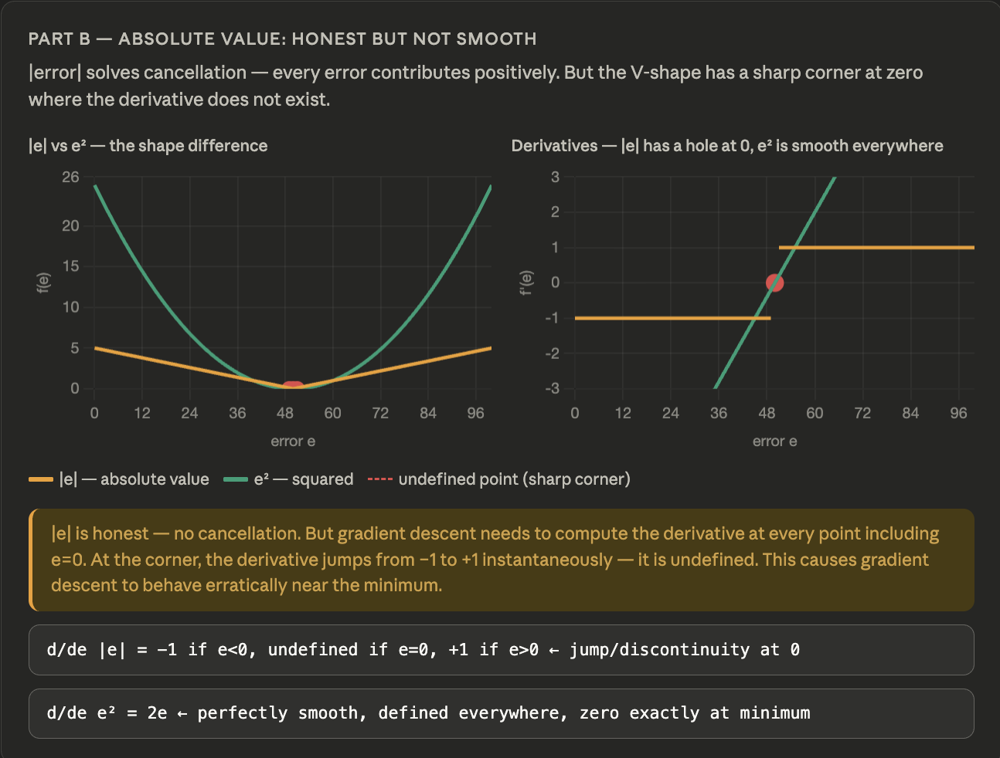
>
> </div>

---

## 3. How to Slope `θ₀,θ₁` to The Minimum (Using Derivatives)

<div align="center">

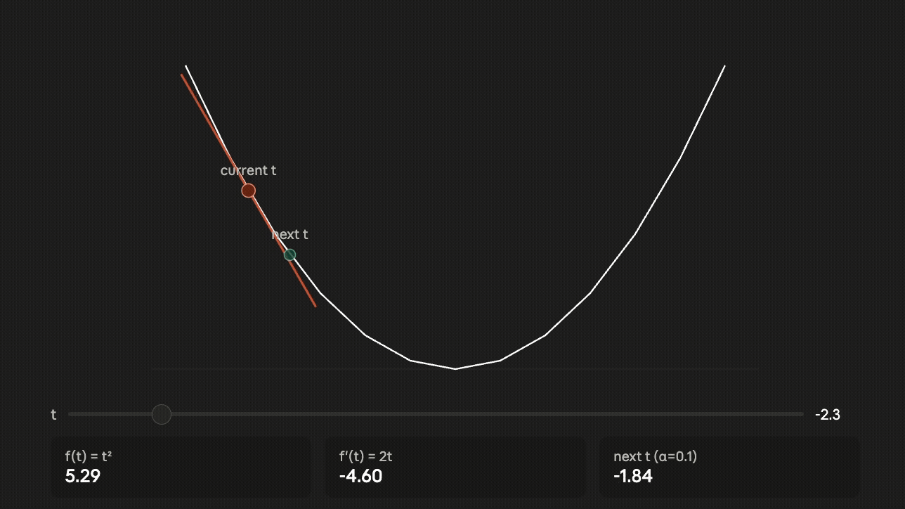

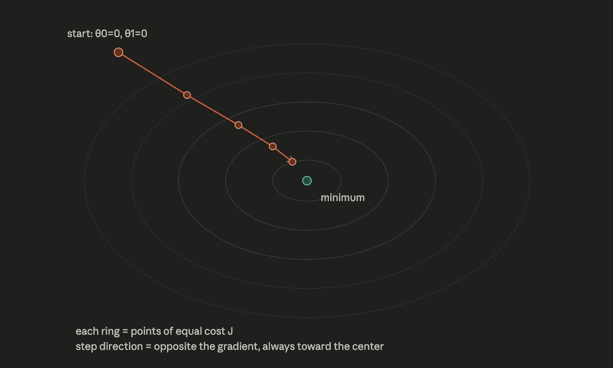

</div>

Think of $J(\theta_0, \theta_1)$ as a landscape — a bowl-shaped surface. To navigate downhill, we need to know the **slope of the surface** in each direction. That's what derivatives give us.

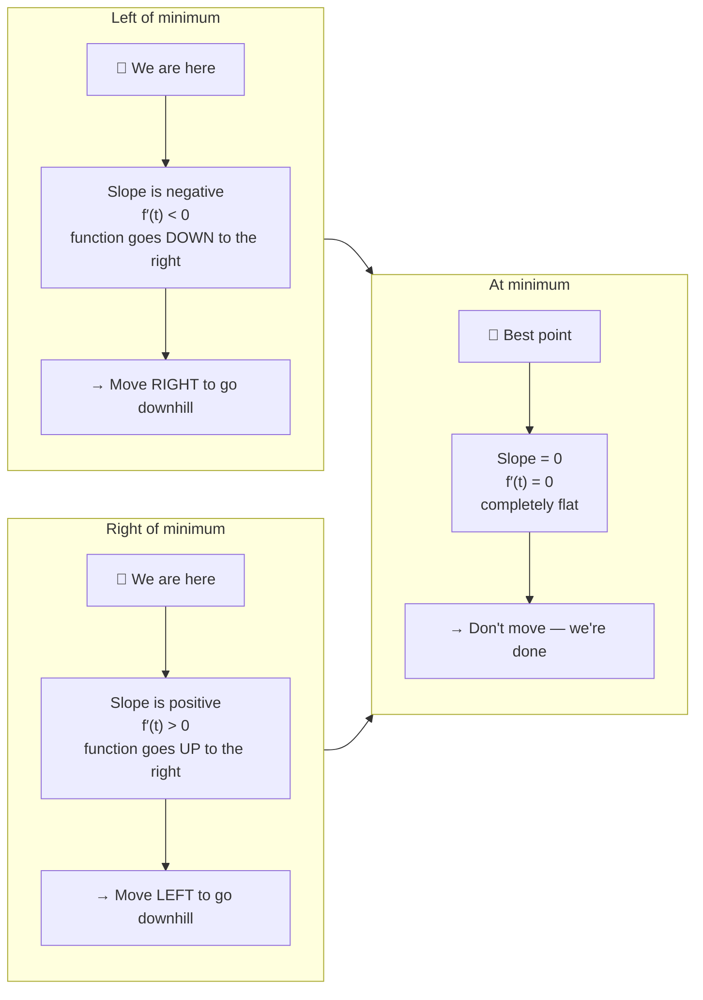

For **two variables** ($\theta_0$ and $\theta_1$), we need **partial derivatives** — one slope per direction:

| Partial derivative | What it tells us |
|:---|:---|
| $\dfrac{\partial J}{\partial \theta_0}$ | How $J$ changes when we nudge $\theta_0$ (keeping $\theta_1$ fixed) |
| $\dfrac{\partial J}{\partial \theta_1}$ | How $J$ changes when we nudge $\theta_1$ (keeping $\theta_0$ fixed) |

The downhill direction is always **opposite to the sign** of each partial derivative.

---

## 4. Computing the Partial Derivatives

Applying the chain rule to $J$ gives us:

$$
\huge \color{cyan}{
\frac{\partial J}{\partial \theta_0} = \frac{1}{m} \sum_{i=1}^{m} \left( h_\theta(x^{(i)}) - y^{(i)} \right)
}
$$

$$
\huge \color{cyan}{
\frac{\partial J}{\partial \theta_1} = \frac{1}{m} \sum_{i=1}^{m} \left( h_\theta(x^{(i)}) - y^{(i)} \right) \cdot x^{(i)}
}
$$

---

> [!NOTE]
> ### ❓ Confusion: "Why are the two formulas different? Why does θ₁ have an extra xⁱ?"
>
> Great question! The reason the derivative with respect to $\theta_1$ has an extra factor $x^{(i)}$ is because the hypothesis depends on $\theta_1$ in a way that is multiplied by the mileage.
>
> Let’s derive both derivatives step by step using the chain rule.

### 1. Recall the cost function

$$
J(\theta_0, \theta_1) = \frac{1}{2m} \sum_{i=1}^{m} \left( \underbrace{\theta_0 + \theta_1 x^{(i)}}_{h_\theta(x^{(i)})} - y^{(i)} \right)^2
$$

We want:

$$
\frac{\partial J}{\partial \theta_0}
\quad \text{and} \quad
\frac{\partial J}{\partial \theta_1}
$$

---

### 2. Derivative with respect to $\theta_0$

Treat $\theta_1$ as constant.

Let:

$$
u = \theta_0 + \theta_1 x^{(i)} - y^{(i)}
$$

Then the cost term becomes:

$$
\frac{1}{2m} u^2
$$

Now apply the chain rule:

$$
\frac{d}{d\theta_0} \left( \frac{1}{2m} u^2 \right)
= \frac{1}{2m} \cdot 2u \cdot \frac{\partial u}{\partial \theta_0}
$$

Since:

$$
\frac{\partial u}{\partial \theta_0} = 1
$$

We get:

$$
\frac{\partial J}{\partial \theta_0}
= \frac{1}{m} \sum_{i=1}^{m} \left( \theta_0 + \theta_1 x^{(i)} - y^{(i)} \right)
$$

👉 No $x^{(i)}$ factor appears because the derivative of $u$ with respect to $\theta_0$ is **1**.

---

### 3. Derivative with respect to $\theta_1$

Now treat $\theta_0$ as constant.

Again:

$$
u = \theta_0 + \theta_1 x^{(i)} - y^{(i)}
$$

Apply the chain rule:

$$
\frac{d}{d\theta_1} \left( \frac{1}{2m} u^2 \right)
= \frac{1}{2m} \cdot 2u \cdot \frac{\partial u}{\partial \theta_1}
$$

But now:

$$
\frac{\partial u}{\partial \theta_1} = x^{(i)}
$$

So:

$$
\frac{\partial J}{\partial \theta_1}
= \frac{1}{m} \sum_{i=1}^{m} \left( \theta_0 + \theta_1 x^{(i)} - y^{(i)} \right) \cdot x^{(i)}
$$

---

### ✅ Key Insight

The extra $x^{(i)}$ comes from differentiating:

$$
\theta_1 x^{(i)}
$$

with respect to $\theta_1$, which gives:

$$
x^{(i)}
$$

That’s why the gradient for $\theta_1$ includes the additional factor.

> 📌 **$\theta_0$** shifts the whole line up/down uniformly — same effect on every car.  
> 📌 **$\theta_1$** rotates the line — and the effect of that rotation grows with mileage. That's why the correction for $\theta_1$ must be weighted by $x^{(i)}$.

---

## 5. The Update Rule — Why the Minus Sign

The core update formula is:

$$
\huge \color{cyan}{
\theta^{\text{new}} = \theta^{\text{old}} - \alpha \cdot f'(\theta^{\text{old}})
}
$$

where $\alpha > 0$ is the **learning rate** (step size).

### The three cases explained

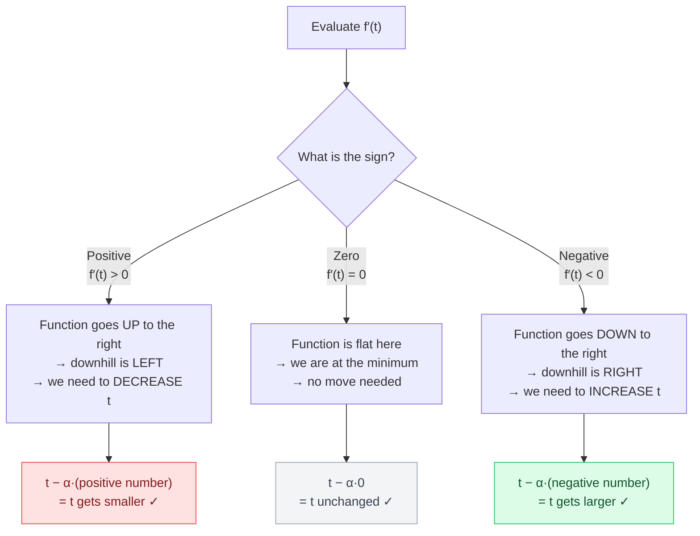

---

> [!TIP]
> ### ❓ Choosing the best learning rate?
>
> Your "learning rate too large / just right / too small" section is currently just three colored text boxes with no visual. Here's what those three cases actually look like as paths down the bowl:
>
> <div align="center">
>
> 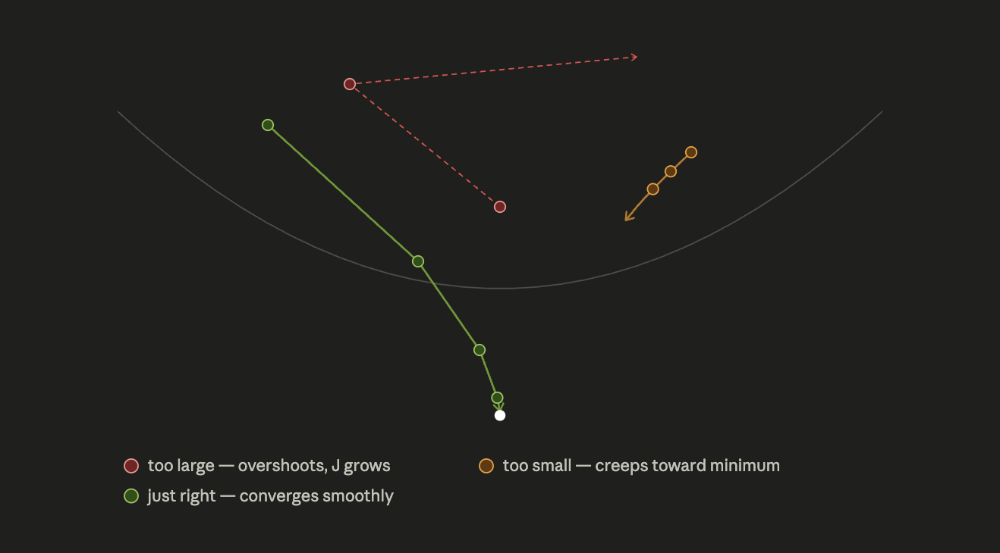
>
> </div>

---

> [!TIP]
> ### ❓ The key insight that clears the blur
>
> The minus sign encodes **"move opposite to the slope"** in one operation. You don't need to check the sign yourself and decide which direction — the formula handles it automatically.
>
> If you used **plus** instead (`t + α·f′(t)`), you'd always move *with* the slope $\rightarrow$ uphill $\rightarrow$ you'd never reach the minimum.

---

### Concrete example with $f(t) = t^2$

$f'(t) = 2t$ — minimum at $t = 0$, $\alpha = 0.1$

| Starting $t$ | $f'(t)$ | Direction needed | Calculation | Result |
|:---:|:---:|:---:|:---:|:---:|
| −3 | −6 | Go right (increase $t$) | $-3 - 0.1 \cdot (-6)$ | **−2.4** ✅ |
| +3 | +6 | Go left (decrease $t$) | $3 - 0.1 \cdot (+6)$ | **+2.4** ✅ |
| 0 | 0 | Stay (at minimum) | $0 - 0.1 \cdot 0$ | **0** ✅ |

---

### Cost decreasing as we step toward the minimum

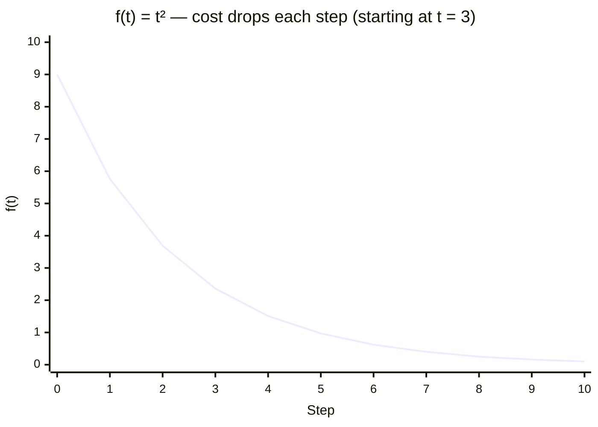

---

## 6. Gradient Descent — The Full Algorithm

For our two-parameter case:

$$\text{tmp}_0 = \theta_0 - \alpha \cdot \frac{1}{m} \sum_{i=1}^{m}(h_\theta(x^{(i)}) - y^{(i)})$$

$$\text{tmp}_1 = \theta_1 - \alpha \cdot \frac{1}{m} \sum_{i=1}^{m}(h_\theta(x^{(i)}) - y^{(i)}) \cdot x^{(i)}$$

$$\theta_0 := \text{tmp}_0 \qquad \theta_1 := \text{tmp}_1$$

---

> [!IMPORTANT]
> ### ❓ Confusion: "Why compute tmp₀ and tmp₁ first? Why not update directly?"
>
> Both gradients must be computed using the **same old** $\theta_0$ and $\theta_1$. If you update $\theta_0$ first and then use the *new* $\theta_0$ to compute the gradient for $\theta_1$, you're no longer following the true downhill direction — you've drifted.
>
> Save both new values to temporaries, then assign both at once. This guarantees you always move from the same point in parameter space.

---

### The iteration loop

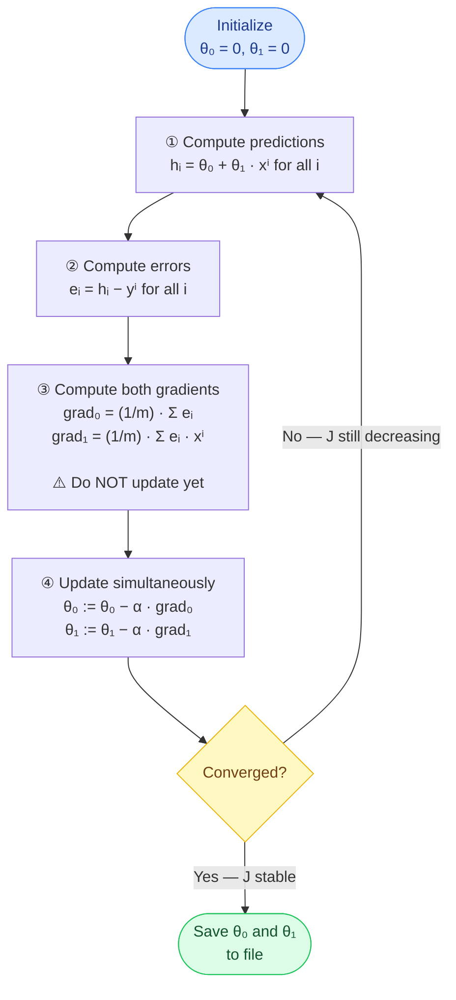

---

### Pseudocode

```python
# Initialize
theta0 = 0.0
theta1 = 0.0
alpha  = 0.001      # learning rate — tune this

for _ in range(num_iterations):
    # Steps 1 & 2: predictions and errors
    errors = [(theta0 + theta1 * x[i] - y[i]) for i in range(m)]

    # Step 3: gradients — both computed from the SAME old theta0, theta1
    grad0 = (1 / m) * sum(errors)
    grad1 = (1 / m) * sum(errors[i] * x[i] for i in range(m))

    # Step 4: simultaneous update
    theta0 = theta0 - alpha * grad0
    theta1 = theta1 - alpha * grad1

# Save to file
save(theta0, theta1)
```

---

### J decreasing over training iterations

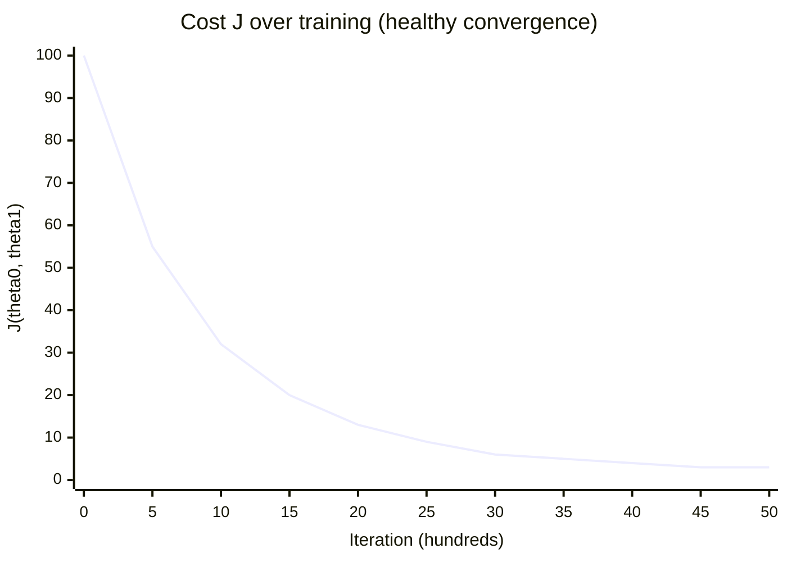

> 💡 $J$ drops steeply at first, then flattens as we approach the minimum. If $J$ goes **up** at any point, your learning rate $\alpha$ is too large.

---

## 7. Stopping Condition

| Method | Description |
|:---|:---|
| **Fixed iterations** | Run for e.g. 10,000 iterations. Simple, works fine for this project. |
| `\|J(new) − J(old)\| < ε` | Stop when the cost barely changes between steps. |
| **Both gradients $\approx 0$** | Stop when $\partial J/\partial \theta_0$ and $\partial J/\partial \theta_1$ are both near zero. True convergence. |

---

### Effect of learning rate α

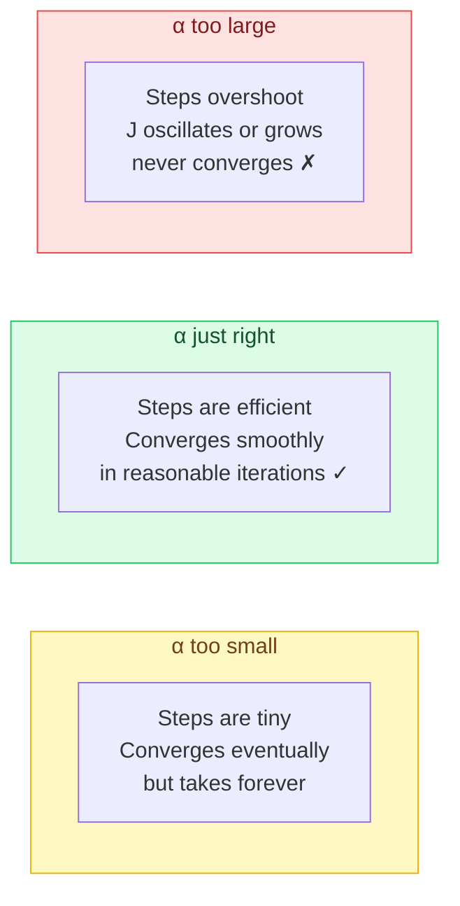

### Why J is convex — there's only one minimum

For linear regression, $J(\theta_0, \theta_1)$ is a **convex** function — a perfect bowl shape. There are no local minima, no saddle traps. Gradient descent is **guaranteed** to find the global minimum if $\alpha$ is not too large.

---

## 8. After Training — Making Predictions

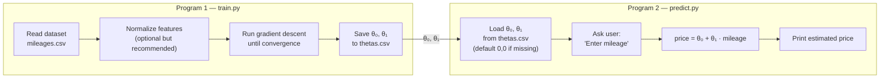

The prediction formula is simply:

$$\text{price} = \theta_0 + \theta_1 \cdot \text{mileage}$$

> 📌 If no model has been trained yet (file missing or $\theta_0=\theta_1=0$), the prediction defaults to 0. That's the correct behavior per the subject.

---

## 9. Quick-Reference Summary

### All formulas in one place

$$h_\theta(x) = \theta_0 + \theta_1 \cdot x$$

$$J(\theta_0, \theta_1) = \frac{1}{2m} \sum_{i=1}^{m} \left(h_\theta(x^{(i)}) - y^{(i)}\right)^2$$

$$\frac{\partial J}{\partial \theta_0} = \frac{1}{m} \sum_{i=1}^{m} \left(h_\theta(x^{(i)}) - y^{(i)}\right)$$

$$\frac{\partial J}{\partial \theta_1} = \frac{1}{m} \sum_{i=1}^{m} \left(h_\theta(x^{(i)}) - y^{(i)}\right) \cdot x^{(i)}$$

$$\theta_0 := \theta_0 - \alpha \cdot \frac{\partial J}{\partial \theta_0} \qquad \theta_1 := \theta_1 - \alpha \cdot \frac{\partial J}{\partial \theta_1} \quad \text{(simultaneously!)}$$

---

### 🔒 Academic Integrity

To preserve the academic integrity of the 42 curriculum, the core training implementation has been intentionally omitted from the public repository.

The repository still includes the complete mathematical documentation, project architecture, visualizations, evaluation utilities, and inference pipeline, providing a comprehensive overview of the project and its design.

The full implementation is available for technical interviews and portfolio reviews upon request.

---

### 📁 Project Structure

```
.
├── mandatory/
│   ├── data.csv                 # Sample training dataset
│   ├── predict.py               # Predicts prices using trained parameters
│   ├── theta.json               # Saved model parameters
│   └── train.py                 # Core training algorithm (omitted)
│
└── bonus/
    ├── plot.py                  # Gradient Descent visualizations
    └── precision.py             # Model evaluation utilities
```

---

<div align="center">
  <sub>Built with ❤️ as part of the 42 Network Curriculum.</sub>
</div>
