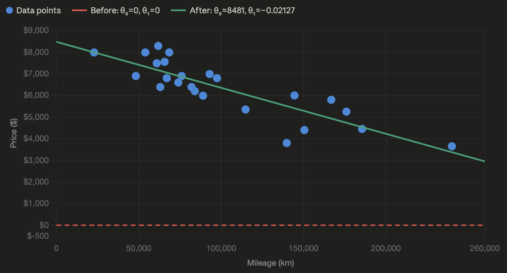
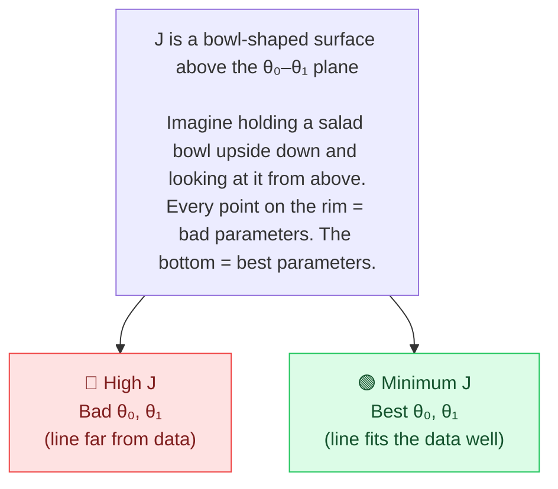
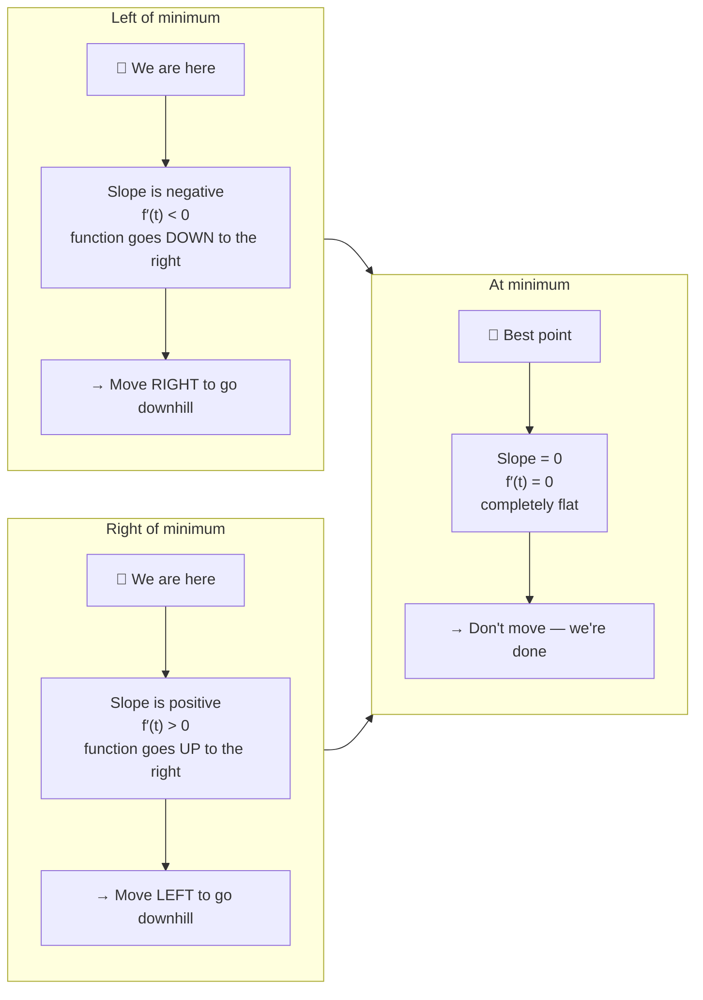
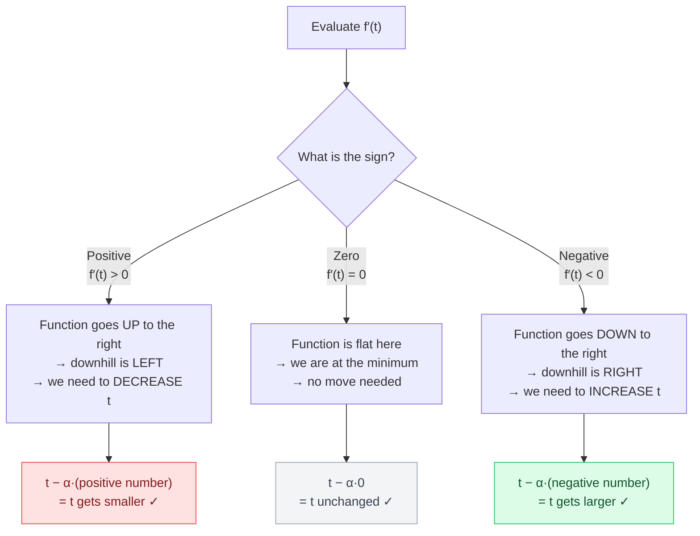
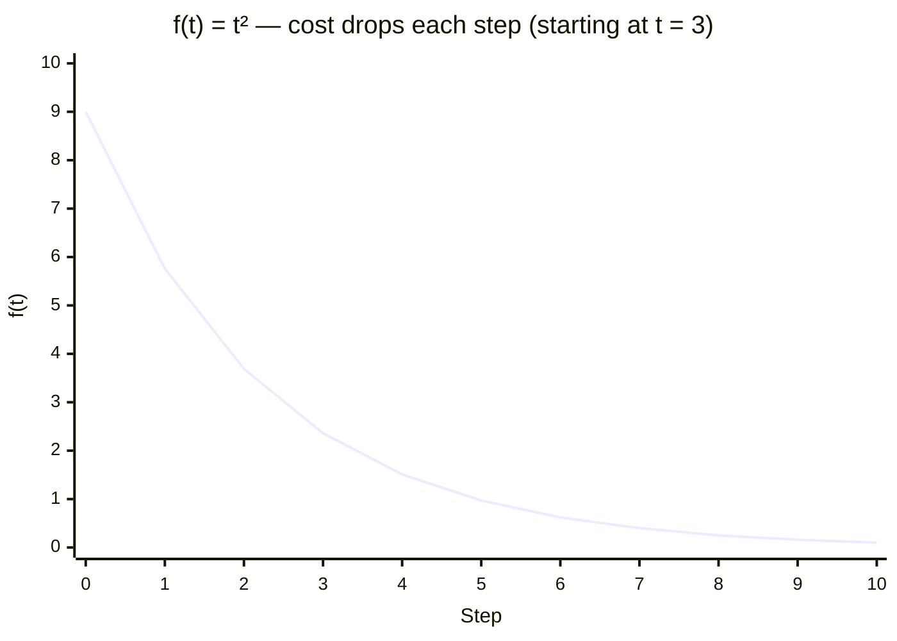
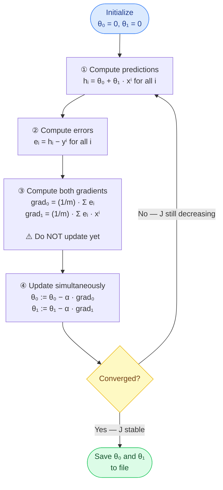
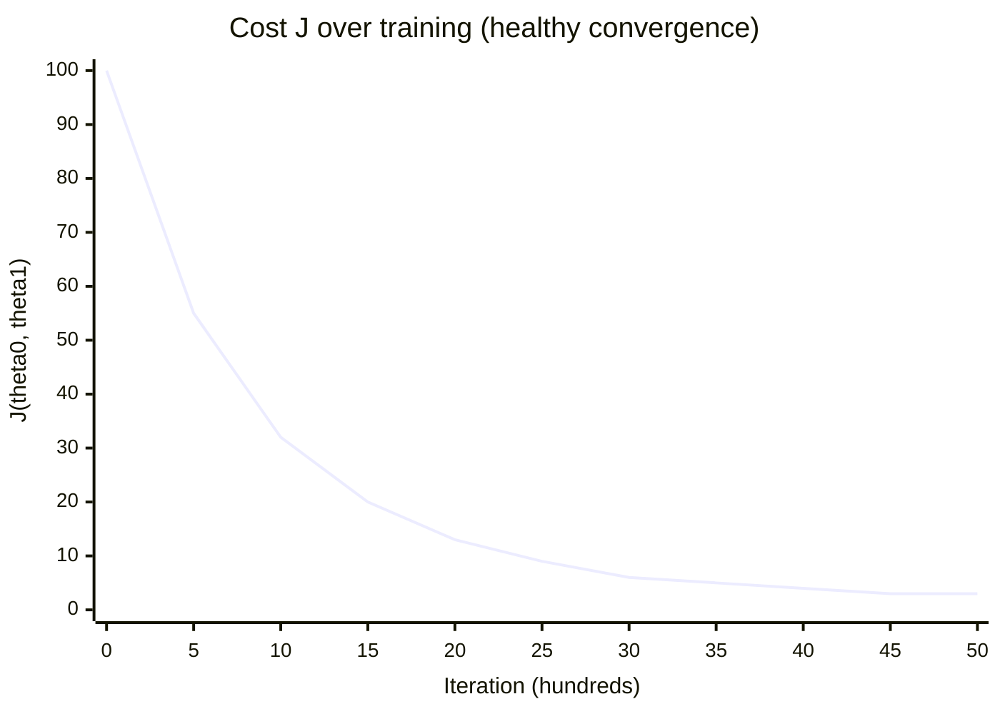
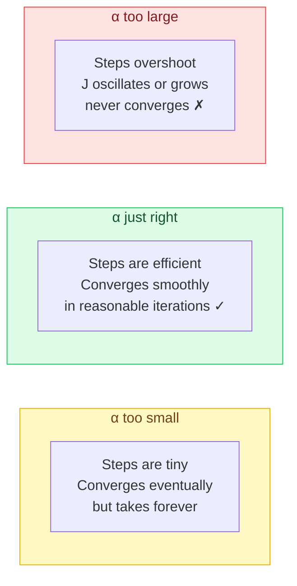
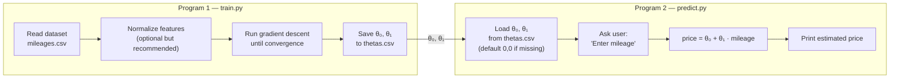

# ft_linear_regression

> A complete, step-by-step guide to the mandatory part — with math, diagrams, and every confusion answered inline.


---

## Table of Contents

1. [The Hypothesis — Our Prediction Line](#1-the-hypothesis--our-prediction-line)
2. [The Cost Function J(θ₀, θ₁)](#2-the-cost-function-jθ₀-θ₁)
3. [Why We Need Derivatives](#3-why-we-need-derivatives)
4. [Computing the Partial Derivatives](#4-computing-the-partial-derivatives)
5. [The Update Rule — Why the Minus Sign](#5-the-update-rule--why-the-minus-sign)
6. [Gradient Descent — The Full Algorithm](#6-gradient-descent--the-full-algorithm)
7. [Stopping Condition](#7-stopping-condition)
8. [After Training — Making Predictions](#8-after-training--making-predictions)
9. [Quick-Reference Summary](#9-quick-reference-summary)

---

## 1. The Hypothesis — Our Prediction Line

We assume that the price of a car depends **linearly** on its mileage. That means our model is a **straight line**:

$$ \Huge{\color{cyan}{h_\theta(x) = \theta_0 + \theta_1 \cdot x}} $$


| Symbol | Meaning |
|--------|---------|
| $x$ | mileage (input feature) |
| $h_\theta(x)$ | predicted price (output) |
| $\theta_0$ | intercept — predicted price when mileage = 0 |
| $\theta_1$ | slope — how much price changes per km |

In this tutorial we will start with **θ₀ = 0** and **θ₁ = 0**. That means your first prediction for every car is price = 0. i know That's completely wrong😅 — but it doesn't matter. The algorithm will fix it later (trust the process).



> **Flat line** = starting guess (θ₀=0, θ₁=0). **Sloped line** = after training. Gradient descent moves us from one to the other.

---

## 2. The Cost Function J(θ₀, θ₁)

We need a single number that measures **how wrong our current line is**. We use the Mean Squared Error, divided by 2 for convenience (it will be canceled later at the derivative):

$$
\huge \color{cyan}{
J(\theta_0, \theta_1) = \frac{1}{2m} \sum_{i=1}^{m} \left( h_\theta(x^{(i)}) - y^{(i)} \right)^2
}
$$

| Symbol | Meaning |
|--------|---------|
| $m$ | number of cars in the dataset (the average) |
| $x^{(i)}$, $y^{(i)}$ | mileage and actual price of car $i$ |
| $h_\theta(x^{(i)}) - y^{(i)}$ | error: predicted minus actual price |

### Why each design choice?

| Choice | Why |
|--------|-----|
| **Square** the error | Prevents positive and negative errors from cancelling. Punishes large errors more than small ones. |
| **Divide by m** | Gets the average — so J doesn't grow just because the dataset is larger. |
| **Divide by 2** | Pure convenience: the 2 cancels when we take the derivative, making the formula cleaner. It doesn't change *where* the minimum is. |

### How J looks as a surface




### ❓ Confusion: "How can we compute J if we don't have the real hθ?"

> **hθ(x) is always computable.** It's not the "true" model — it's just our current guess: `θ₀ + θ₁ · x`. At any point in training, we know θ₀ and θ₁ (we initialized them to 0), and we know every `xⁱ` from the dataset. So we can always compute `hθ(xⁱ)` and therefore J.
>
> The dataset (all `xⁱ` and `yⁱ`) is **fixed**. The only things that change are θ₀ and θ₁.

### ❓ Confusion: "Why write J(θ₀, θ₁) instead of just J?"

> Because J depends **only** on θ₀ and θ₁. The data never changes. Writing `J(θ₀, θ₁)` makes it explicit: the only knobs we control are the two parameters. Our goal is to find the (θ₀, θ₁) pair that makes J as small as possible.

### ❓ Confusion: "How do we know J(θ₀, θ₁) is bowl‑shaped?"

### ❓ Confusion: "Is that why we squared the error?"

---

## 3. Why We Need Derivatives

Think of `J(θ₀, θ₁)` as a landscape — a bowl-shaped surface. To navigate downhill, we need to know the **slope of the surface** in each direction. That's what derivatives give us.



For **two variables** (θ₀ and θ₁), we need **partial derivatives** — one slope per direction:

| Partial derivative | What it tells us |
|--------------------|-----------------|
| $\dfrac{\partial J}{\partial \theta_0}$ | How J changes when we nudge θ₀ (keeping θ₁ fixed) |
| $\dfrac{\partial J}{\partial \theta_1}$ | How J changes when we nudge θ₁ (keeping θ₀ fixed) |

The downhill direction is always **opposite to the sign** of each partial derivative.

---

## 4. Computing the Partial Derivatives

Applying the chain rule to J gives us:

$$
\huge \color{cyan}{
\frac{\partial J}{\partial \theta_0} = \frac{1}{m} \sum_{i=1}^{m} \left( h_\theta(x^{(i)}) - y^{(i)} \right)
}
$$

$$
\huge \color{cyan}{
\frac{\partial J}{\partial \theta_1} = \frac{1}{m} \sum_{i=1}^{m} \left( h_\theta(x^{(i)}) - y^{(i)} \right) \cdot x^{(i)}
}
$$

### ❓ Confusion: "Why are the two formulas different? Why does θ₁ have an extra xⁱ?"

Great question! The reason the derivative with respect to $\theta_1$ has an extra factor $x^{(i)}$ is because the hypothesis depends on $\theta_1$ in a way that is multiplied by the mileage.

Let’s derive both derivatives step by step using the chain rule.


### 1. Recall the cost function

$$
J(\theta_0, \theta_1) = \frac{1}{2m} \sum_{i=1}^{m} \left( \underbrace{\theta_0 + \theta_1 x^{(i)}}_{h_\theta(x^{(i)})} - y^{(i)} \right)^2
$$

We want:

$$
\frac{\partial J}{\partial \theta_0}
\quad \text{and} \quad
\frac{\partial J}{\partial \theta_1}
$$


### 2. Derivative with respect to $\theta_0$

Treat $\theta_1$ as constant.

Let:

$$
u = \theta_0 + \theta_1 x^{(i)} - y^{(i)}
$$

Then the cost term becomes:

$$
\frac{1}{2m} u^2
$$

Now apply the chain rule:

$$
\frac{d}{d\theta_0} \left( \frac{1}{2m} u^2 \right)
= \frac{1}{2m} \cdot 2u \cdot \frac{\partial u}{\partial \theta_0}
$$

Since:

$$
\frac{\partial u}{\partial \theta_0} = 1
$$

We get:

$$
\frac{\partial J}{\partial \theta_0}
= \frac{1}{m} \sum_{i=1}^{m} \left( \theta_0 + \theta_1 x^{(i)} - y^{(i)} \right)
$$

👉 No $x^{(i)}$ factor appears because the derivative of $u$ with respect to $\theta_0$ is **1**.


### 3. Derivative with respect to $\theta_1$

Now treat $\theta_0$ as constant.

Again:

$$
u = \theta_0 + \theta_1 x^{(i)} - y^{(i)}
$$

Apply the chain rule:

$$
\frac{d}{d\theta_1} \left( \frac{1}{2m} u^2 \right)
= \frac{1}{2m} \cdot 2u \cdot \frac{\partial u}{\partial \theta_1}
$$

But now:

$$
\frac{\partial u}{\partial \theta_1} = x^{(i)}
$$

So:

$$
\frac{\partial J}{\partial \theta_1}
= \frac{1}{m} \sum_{i=1}^{m} \left( \theta_0 + \theta_1 x^{(i)} - y^{(i)} \right) \cdot x^{(i)}
$$


### ✅ Key Insight

The extra $x^{(i)}$ comes from differentiating:

$$
\theta_1 x^{(i)}
$$

with respect to $\theta_1$, which gives:

$$
x^{(i)}
$$

That’s why the gradient for $\theta_1$ includes the additional factor.

> **θ₀** shifts the whole line up/down uniformly — same effect on every car.
>
> **θ₁** rotates the line — and the effect of that rotation grows with mileage. That's why the correction for θ₁ must be weighted by `xⁱ`.


---

## 5. The Update Rule — Why the Minus Sign

The core update formula is:

$$
\huge \color{cyan}{
\theta^{\text{new}} = \theta^{\text{old}} - \alpha \cdot f'(\theta^{\text{old}})
}
$$

where $\alpha > 0$ is the **learning rate** (step size).

### The three cases explained



### ❓ The key insight that clears the blur

> The minus sign encodes **"move opposite to the slope"** in one operation. You don't need to check the sign yourself and decide which direction — the formula handles it automatically.
>
> If you used **plus** instead (`t + α·f′(t)`), you'd always move *with* the slope → uphill → you'd never reach the minimum.

### Concrete example with f(t) = t²

`f′(t) = 2t` — minimum at `t = 0`, `α = 0.1`

| Starting t | f′(t) | Direction needed | Calculation | Result |
|-----------|-------|-----------------|-------------|--------|
| −3 | −6 | Go right (increase t) | −3 − 0.1·(−6) | **−2.4** ✅ |
| +3 | +6 | Go left (decrease t) | 3 − 0.1·(+6) | **+2.4** ✅ |
| 0 | 0 | Stay (at minimum) | 0 − 0.1·0 | **0** ✅ |

### Cost decreasing as we step toward the minimum



---

## 6. Gradient Descent — The Full Algorithm

For our two-parameter case:

$$\text{tmp}_0 = \theta_0 - \alpha \cdot \frac{1}{m} \sum_{i=1}^{m}(h_\theta(x^{(i)}) - y^{(i)})$$

$$\text{tmp}_1 = \theta_1 - \alpha \cdot \frac{1}{m} \sum_{i=1}^{m}(h_\theta(x^{(i)}) - y^{(i)}) \cdot x^{(i)}$$

$$\theta_0 := \text{tmp}_0 \qquad \theta_1 := \text{tmp}_1$$

### ❓ Confusion: "Why compute tmp₀ and tmp₁ first? Why not update directly?"

> Both gradients must be computed using the **same old** θ₀ and θ₁. If you update θ₀ first and then use the *new* θ₀ to compute the gradient for θ₁, you're no longer following the true downhill direction — you've drifted.
>
> Save both new values to temporaries, then assign both at once. This guarantees you always move from the same point in parameter space.

### The iteration loop



### Pseudocode

```python
# Initialize
theta0 = 0.0
theta1 = 0.0
alpha  = 0.001      # learning rate — tune this

for _ in range(num_iterations):
    # Steps 1 & 2: predictions and errors
    errors = [(theta0 + theta1 * x[i] - y[i]) for i in range(m)]

    # Step 3: gradients — both computed from the SAME old theta0, theta1
    grad0 = (1 / m) * sum(errors)
    grad1 = (1 / m) * sum(errors[i] * x[i] for i in range(m))

    # Step 4: simultaneous update
    theta0 = theta0 - alpha * grad0
    theta1 = theta1 - alpha * grad1

# Save to file
save(theta0, theta1)
```

### J decreasing over training iterations



> J drops steeply at first, then flattens as we approach the minimum. If J goes **up** at any point, your learning rate α is too large.

---

## 7. Stopping Condition

| Method | Description |
|--------|-------------|
| Fixed iterations | Run for e.g. 10,000 iterations. Simple, works fine for this project. |
| `\|J(new) − J(old)\| < ε` | Stop when the cost barely changes between steps. |
| Both gradients ≈ 0 | Stop when `∂J/∂θ₀` and `∂J/∂θ₁` are both near zero. True convergence. |

### Effect of learning rate α



### Why J is convex — there's only one minimum

For linear regression, `J(θ₀, θ₁)` is a **convex** function — a perfect bowl shape. There are no local minima, no saddle traps. Gradient descent is **guaranteed** to find the global minimum if α is not too large.

---

## 8. After Training — Making Predictions



The prediction formula is simply:

$$\text{price} = \theta_0 + \theta_1 \cdot \text{mileage}$$

> If no model has been trained yet (file missing or θ₀=θ₁=0), the prediction defaults to 0. That's the correct behavior per the subject.

---

## 9. Quick-Reference Summary

### All formulas in one place

$$h_\theta(x) = \theta_0 + \theta_1 \cdot x$$

$$J(\theta_0, \theta_1) = \frac{1}{2m} \sum_{i=1}^{m} \left(h_\theta(x^{(i)}) - y^{(i)}\right)^2$$

$$\frac{\partial J}{\partial \theta_0} = \frac{1}{m} \sum_{i=1}^{m} \left(h_\theta(x^{(i)}) - y^{(i)}\right)$$

$$\frac{\partial J}{\partial \theta_1} = \frac{1}{m} \sum_{i=1}^{m} \left(h_\theta(x^{(i)}) - y^{(i)}\right) \cdot x^{(i)}$$

$$\theta_0 := \theta_0 - \alpha \cdot \frac{\partial J}{\partial \theta_0} \qquad \theta_1 := \theta_1 - \alpha \cdot \frac{\partial J}{\partial \theta_1} \quad \text{(simultaneously!)}$$

### Every confusion, answered

| Question | One-line answer | Section |
|----------|----------------|---------|
| How can we compute J without the real hθ? | hθ is just our current guess — always computable from θ₀, θ₁, and the data. | [§2](#2-the-cost-function-jθ₀-θ₁) |
| Why write J(θ₀, θ₁)? | J depends only on the parameters; the data is fixed. | [§2](#2-the-cost-function-jθ₀-θ₁) |
| Why different formulas for θ₀ and θ₁? | θ₁ rotates the line, so its effect scales with mileage → needs the xⁱ factor. | [§4](#4-computing-the-partial-derivatives) |
| Why the minus sign in the update? | It moves us *opposite* to the slope — always downhill. | [§5](#5-the-update-rule--why-the-minus-sign) |
| What if the slope is already negative? | minus × negative = plus → we increase t → still downhill. | [§5](#5-the-update-rule--why-the-minus-sign) |
| Why simultaneous update with tmp variables? | Both gradients must use the same old θ values or we drift off the true direction. | [§6](#6-gradient-descent--the-full-algorithm) |
| How do we know we're at the minimum? | Both gradients ≈ 0 and J stops decreasing. | [§7](#7-stopping-condition) |

---

*Written as part of the 42 School `ft_linear_regression` project.*
